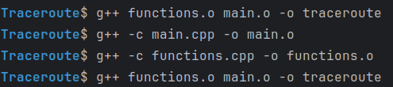
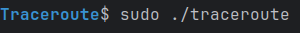
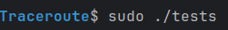

# Утилита Traceroute, которая работает через ICMP протокол.
## Сборка и запуск утилиты Traceroute
### Для сборки утилиты Traceroute через объектные файлы выполните следующие шаги:

### Для корректной работы программы запускайте ее от имени суперпользователя:

## Сборка и запуск тестов
### Для сборки тестов выполните аналогичные шаги сборки основной программы:

### Для корректной работы тестов запускайте их от имени суперпользователя:
